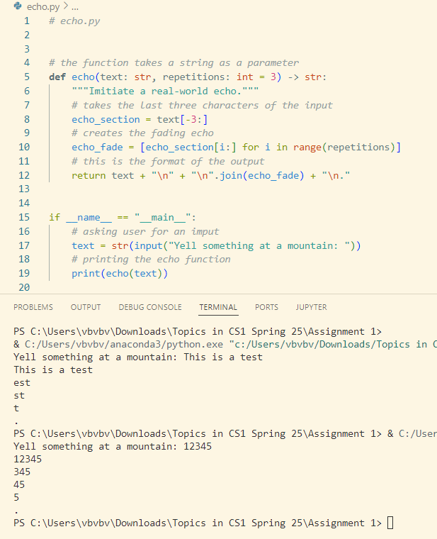
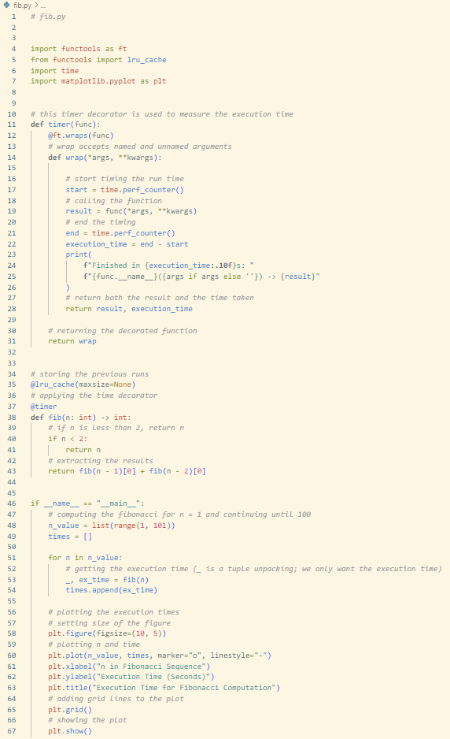
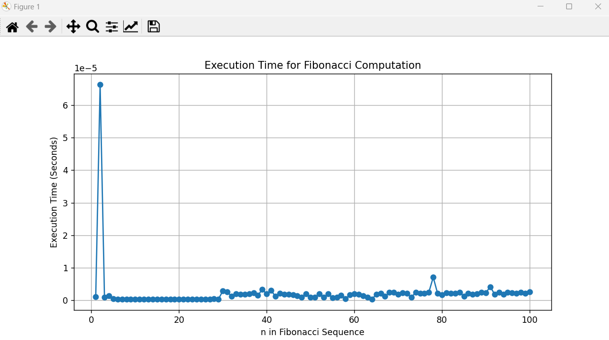

### CS3980 Assignment 1

*** Here's my code, comments explaining the code, and explinations of what the outputs are. ***
*** The screenshots show the code and the commented explinations. ***

## Echo.py

For this file, the objective is to create code where, once an input is given, 
the output is an "echoed sound with a fading effect," as stated in the assignment.

## Fib.py

For this file, the objective is to create code that calculates and graphs the Fibonacci sequence.
The output when the code is run is a list of the time it takes to execute the Fibonacci sequence along with a graph corresponding to that data.
*** I used matplotlib to visualize the data. Here is an image of the graph: ***

